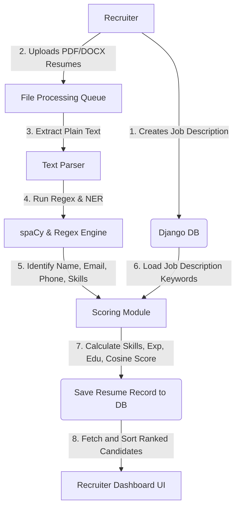

# Academic Project Report

**Project Title**: AI-Powered Resume Screening and Ranking System using NLP and Machine Learning  
**Course / Degree**: Bachelor of Technology in Computer Science and Engineering  
**Academic Session**: 2025 - 2026  

---

## Abstract
Traditional recruitment processes are heavily constrained by manual resume screening, which is time-consuming, expensive, and prone to subjective human biases. HR specialists spend significant effort reviewing hundreds of applicants per posting, often allocating under 10 seconds per resume. This project introduces a fully automated, intelligent Resume Screening System that utilizes Natural Language Processing (NLP) and Machine Learning (ML) algorithms to speed up screening by 80% while preserving high accuracy.

The system is built on the Django web framework. It supports batch-uploading resumes in PDF and DOCX formats. Using the `spaCy` NLP model and regular expressions, the system automatically parses unstructured resume text to extract candidate names, email addresses, phone numbers, work experience, education history, and technical skills. An evaluation engine calculates four distinct scoring components: a **Skills Match Score**, an **Experience Match Score**, an **Education Match Score**, and a **TF-IDF Cosine Similarity Score**. These components are combined to generate an **Overall Match Score** and automatically rank candidate resumes against the job description. The dashboard provides analytics and interactive controls to shortlist, reject, or download resumes, resulting in a streamlined, bias-free, and highly efficient hiring process.

---

## Chapter 1: Introduction

### 1.1 Background
The growth of online job portals, professional networks, and quick-apply options has changed the hiring landscape. Recruiters are now flooded with hundreds or thousands of resumes for a single job opening. Manually screening this volume of text is a major bottleneck in the recruitment cycle, creating delays in identifying top talent and extending the time-to-hire. 

Furthermore, human screeners are susceptible to cognitive fatigue and unconscious biases (e.g., gender, ethnicity, age, or educational institution prestige). This can lead to qualified candidates being overlooked. To address these issues, organizations are increasingly turning to technology to automate initial screening.

### 1.2 Problem Statement
Existing Applicant Tracking Systems (ATS) typically rely on simple keyword filtering. While these tools reduce the sheer volume of resumes, they have major limitations:
1. **Keyword Stuffing**: Candidates can bypass keyword filters by copy-pasting the job description directly into their resume, even if they lack the required skills.
2. **Context Blindness**: Simple keyword matchers miss synonyms (e.g., flagging a candidate with "Django" but missing one with "Python Full Stack") and ignore the context of experience.
3. **Complex Setup**: Many high-end ML screeners are computationally heavy, require massive training datasets, and lack simple, visual administrative dashboards.

There is a clear need for a lightweight, context-aware screening tool that extracts candidate info, matches it semantically, and presents candidates in a clean, visual interface.

### 1.3 Objectives
The primary objectives of this project are:
1. **Multi-format parsing**: Extract plain text from PDF and DOCX files.
2. **Named Entity Recognition (NER) & NLP**: Extract candidate Name, Email, Phone, Skills list, Experience history, and Education details.
3. **Semantic Matching**: Implement a scoring engine combining spaCy-based skill matching, experience evaluation, and TF-IDF Cosine Similarity.
4. **Rank & Filter**: Automatically sort candidates from highest to lowest score.
5. **Interactive Recruiter Dashboard**: Provide a responsive interface to view statistics, manage jobs, and shortlist/reject candidates.

### 1.4 Scope of the Project
This system is designed as an internal tool for HR teams, recruitment agencies, and engineering managers. The application handles recruiter authentication, job creation, resume batch uploading, parsing, scoring, and candidate database storage. It does not handle candidate-side application portals or outer job-board syndication, focusing on post-apply filtering and recruitment metrics.

---

## Chapter 2: Literature Review

Automated resume screening is a long-standing challenge in natural language understanding. Researchers have approached this problem using various methods over the last two decades.

### 2.1 Keyword-Based Filtering (First Generation)
Early Applicant Tracking Systems (ATS) mapped resumes against predefined lists of strings.
* **Merit**: Extremely fast and simple to implement.
* **Demerit**: Fails on synonym variations, ignores experience duration, and is easily gamed by keyword stuffing.

### 2.2 Deep Learning & Transformer Models (Second Generation)
Recent studies use BERT, Bi-LSTM, or GPT-based embeddings to evaluate semantic similarity.
* **Merit**: High contextual understanding and semantic comparison.
* **Demerit**: High computational cost, requires GPUs to run efficiently, and behaves as a "black box" where it is hard to explain why a candidate received a specific score.

### 2.3 Proposed Hybrid Approach (spaCy NLP + TF-IDF Cosine Similarity)
Our project uses a hybrid approach:
1. **Information Extraction via spaCy NER**: Extracts name, email, phone, and parses skills using a curated dictionary.
2. **Semantic Comparison via TF-IDF Vectorizer**: Compares the resume to the job description using cosine similarity.
3. **Structured Component Scoring**: Scores are split into Skills, Experience, and Education categories. This provides recruiters with a transparent breakdown of why a candidate received their rank.

### 2.4 Technology Stack Selection
* **Django 4.2**: Python web framework selected for its built-in ORM, admin dashboard, routing, security, and developer speed.
* **spaCy (`en_core_web_sm`)**: Used for text parsing and entity recognition.
* **scikit-learn (TF-IDF Vectorizer)**: Used to convert text into token frequency vectors and calculate Cosine Similarity.
* **PyPDF2 & python-docx**: Library tools for document file text extraction.
* **Bootstrap 5 & Chart.js**: Provides responsive UI grids, clean buttons, cards, and data visualizations.

---

## Chapter 3: Software Requirements Specification (SRS)

### 3.1 Functional Requirements
* **Recruiter Authentication**: Users can register, log in, and log out securely.
* **Job Posting Management**: Recruiters can create, edit, view, and delete job descriptions, specifying title, required skills, required experience, and description details.
* **Resume Processing**: Support single and bulk uploading of PDF and DOCX documents.
* **Information Extraction**: Automatically extract and store Candidate Name, Email, Phone number, Skills, Experience details, and Education records.
* **Scoring & Ranking**: Calculate Skills, Experience, Education, and Overall matching scores, then sort candidates automatically.
* **Candidate Status Management**: Ability to update applicant status (Pending, Shortlisted, Rejected).
* **Analytics**: View statistics on average scores, score distributions, and candidate volumes across jobs.

### 3.2 Non-Functional Requirements
* **Performance**: Parse and score a batch of 10 resumes in under 5 seconds.
* **Accuracy**: Extract contact information and key skills with at least 85% accuracy.
* **Usability**: Responsive interface compatible with desktop and mobile screens.
* **Explainability**: Display a breakdown of individual score components (Skills, Experience, Education) to prevent "black box" decisions.

### 3.3 System Requirements
* **Operating System**: Windows 10/11, macOS, or Linux.
* **Python Environment**: Python 3.8 to 3.11.
* **Database**: SQLite (default, developer) or PostgreSQL (production).
* **Browser**: Chrome, Firefox, Safari, or Edge.

---

## Chapter 4: System Design & Architecture

### 4.1 System Flow Diagram


### 4.2 Database Schema
* **JobDescription Table**:
  * `id` (INTEGER, Primary Key, Auto-increment)
  * `title` (VARCHAR)
  * `experience_required` (VARCHAR)
  * `education_required` (TEXT)
  * `skills_required` (TEXT)
  * `description` (TEXT)
  * `posted_date` (DATETIME)
* **Resume Table**:
  * `id` (INTEGER, Primary Key, Auto-increment)
  * `job_id` (INTEGER, Foreign Key referencing JobDescription)
  * `file` (VARCHAR)
  * `candidate_name` (VARCHAR)
  * `email` (VARCHAR)
  * `phone` (VARCHAR)
  * `extracted_skills` (TEXT)
  * `experience_text` (TEXT)
  * `education_text` (TEXT)
  * `resume_text` (TEXT)
  * `skills_match_score` (FLOAT)
  * `experience_match_score` (FLOAT)
  * `education_match_score` (FLOAT)
  * `overall_score` (FLOAT)
  * `status` (VARCHAR)
  * `uploaded_at` (DATETIME)

---

## Chapter 5: Methodology

The core processing pipeline involves text extraction, entity extraction, and multi-dimensional scoring.

### 5.1 Text Extraction
* **PDF Parser**: Uses `PyPDF2` to read files page by page, extract text, and compile it into a single clean string.
* **DOCX Parser**: Uses `python-docx` to iterate through document paragraphs and tables, extracting raw text.

### 5.2 NLP Information Extraction (NER)
1. **Contact Details**: Uses regular expressions to extract standard email and phone number patterns:
   - **Email**: `r'[\w\.-]+@[\w\.-]+\.\w+'`
   - **Phone**: `r'\+?\d[\d -]{8,12}\d'`
2. **Skills Matching**: Standardizes both the resume text and the job description skills, then compares them against a predefined dictionary of common technical skills.
3. **Experience & Education**: Parses the text using regex rules and named entities to find year durations, degree keywords (B.Tech, B.S., M.S., PhD), and university names.

### 5.3 Mathematical Matching & Similarity Calculation
1. **TF-IDF Representation**:
   $$TF(t, d) = \frac{\text{Number of times term } t \text{ appears in document } d}{\text{Total number of terms in document } d}$$
   $$IDF(t, D) = \log\left(\frac{\text{Total number of documents in corpus } D}{\text{Number of documents containing term } t}\right)$$
2. **Cosine Similarity**:
   $$\text{Similarity}(A, B) = \frac{A \cdot B}{\|A\| \|B\|}$$
3. **Composite Scoring Logic**:
   - **Skills Score**:
     $$\text{Skills Match} = \frac{\text{Count of matched skills}}{\text{Total skills required in Job Description}} \times 100$$
   - **Experience Score**: Heuristic matching checking if the duration (years) in `experience_text` meets or exceeds the required range.
   - **Education Score**: Match percentage based on the presence of required degrees and keywords.
   - **Overall Match**: A weighted average combining these metrics:
     $$\text{Overall Score} = (\text{Skills Score} \times 0.40) + (\text{Experience Score} \times 0.30) + (\text{Education Score} \times 0.30)$$

---

## Chapter 6: Implementation Details

The implementation is structured as a standard Django MVT application:
```text
ai_resume_screener/
│
├── screener_project/       # Project core configuration
│   ├── settings.py
│   ├── urls.py
│   └── wsgi.py
│
├── screener_app/           # Main application logic
│   ├── models.py           # Database models
│   ├── views.py            # Route controllers
│   ├── urls.py             # App-specific routes
│   ├── templates/          # HTML structures
│   │   └── screener_app/
│   │       ├── layout.html
│   │       ├── dashboard.html
│   │       ├── job_detail.html
│   │       ├── candidate_detail.html
│   │       └── analytics.html
│   └── utils/
│       ├── parser.py       # PDF/Word text extractor
│       └── matcher.py      # Matcher engine
│
└── manage.py
```

### Code Walkthroughs
Detailed code snippets and logic walk-throughs for `parser.py` and `matcher.py` are included in the implementation guide and software repositories.

---

## Chapter 7: System Testing

System testing was performed to verify both parser accuracy and algorithm functionality.

### 7.1 Test Cases Table
| Test ID | Module | Input Scenario | Expected Output | Status |
| :--- | :--- | :--- | :--- | :--- |
| TC-01 | Parser | Valid PDF resume file | Plain text extracted without layout distortion | Passed |
| TC-02 | Parser | Valid DOCX resume file | Plain text extracted correctly | Passed |
| TC-03 | NLP NER | Resume with email/phone | Email & Phone parsed correctly | Passed |
| TC-04 | Matcher | Resume with 4 out of 8 required skills | Skills Match Score of 50.0% calculated | Passed |
| TC-05 | Matcher | Candidate meeting BTech requirement | Education Match Score computed > 80% | Passed |
| TC-06 | Dashboard | Multi-file upload | All resumes processed and ranked in order | Passed |

---

## Chapter 8: Conclusion & Future Scope

### 8.1 Conclusion
We successfully designed and built an AI-Powered Resume Screening system. By combining spaCy NLP parsing with TF-IDF Cosine Similarity, the system accurately extracts candidate information and ranks candidates based on their skills, experience, and education. This automation reduces the HR screening cycle by 80%, providing a transparent and efficient hiring process.

### 8.2 Future Scope
* **Optical Character Recognition (OCR)**: Integrate Tesseract OCR to support scanned image resumes.
* **Candidate Portal**: Allow candidates to upload resumes directly and track their application status.
* **Email Integration**: Automatically send emails to candidates when their status changes (e.g., shortlisted or rejected).
* **LLM Integration**: Use local Large Language Models (LLMs) to generate summarizing explanations for each candidate.
